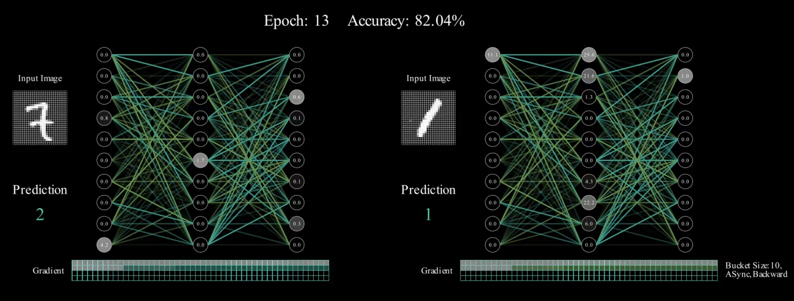

# DDP Mainim

DDP Mainim is a toy project for illustrating the concept of Pytorch DDP (Distributed Data Parallelism) using `Mainim`.



This project is highly inspired by the blog [Visualizing a Neural Network using Manim](https://medium.com/@rossedwards_14988/visualizing-a-neural-network-using-manim-part-1-664387704a49).

## Install

Install the `mainim` and related packages:

``` shell
python3.13 -m venv .venv
source .venv/bin/activate
pip install -r requirements.txt
```

Download the dataset from this [link](https://www.kaggle.com/competitions/digit-recognizer/data) to the `./digit-recognizer/` dir.

## Run

Use the following command to build the `ddp` video:

``` shell
manim -pqh ddp.py VisualiseNeuralNetwork
```

You can find the video at `./media/videos/ddp/1080p60/VisualiseNeuralNetwork.mp4`.

Use the following command to build the standalone version. before run the command, you can adjust the frame parameter in `manim.cfg` to have a more beautiful video:

``` shell
manim -pqh standalone.py VisualiseNeuralNetwork
```

BTW, there is also a `model.py` file to run the model without `mainim`.

``` shell
python model.py
```

## Reference

- [Visualizing a Neural Network using Manim](https://medium.com/@rossedwards_14988/visualizing-a-neural-network-using-manim-part-1-664387704a49)
- [PyTorch Distributed: Experiences on Accelerating
Data Parallel Training](https://arxiv.org/pdf/2006.15704)
- [Manim Community](https://www.manim.community/)
